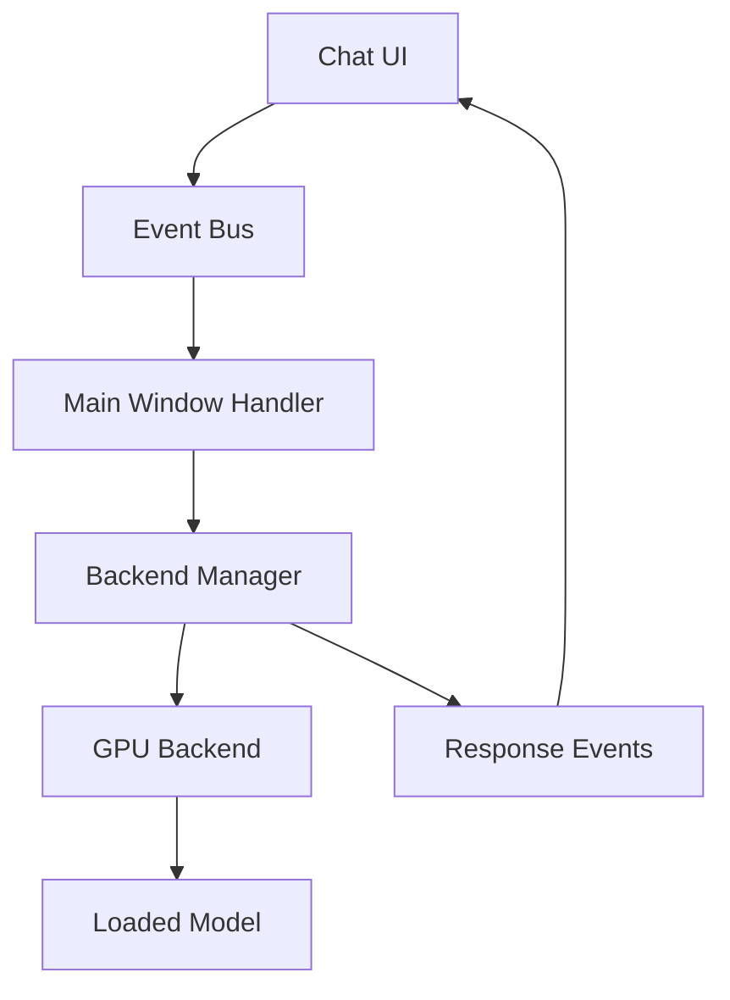

# Design Document

## Overview

The GGUF loader application has a working GPU-accelerated backend system with a BackendManager that handles model loading and text generation. However, the chat functionality is not properly configured to use this new system. The chat UI publishes "chat.send" events which are handled by the main window's `_on_chat_generation_request` method, but this method incorrectly checks for `backend_manager.current_backend` instead of using the proper model service integration.

The issue is that the chat system needs to be reconfigured to use the new GPU accelerating model loading through the BackendManager, replacing the old direct model service calls.

## Architecture

### Current Architecture Issues

The current chat flow has these problems:
- Chat UI publishes "chat.send" events
- Main window handles these events in `_on_chat_generation_request`
- The handler checks `self.backend_manager.current_backend` but this may not be properly initialized
- The model service still uses old llama-cpp-python direct calls instead of the BackendManager
- There's a disconnect between the BackendManager (which works) and the chat system

### New Architecture Overview



The solution is to:
1. Ensure the BackendManager is properly initialized and connected
2. Update the chat generation handler to use BackendManager directly
3. Remove dependencies on the old ModelService for chat
4. Ensure proper error handling when no model is loaded

## Components and Interfaces

### 1. Backend Manager Integration

The BackendManager already exists and works correctly. The issue is ensuring it's properly connected to the chat system:

```python
class MainWindow:
    def _on_chat_generation_request(self, data: Dict[str, Any]):
        """Handle chat generation request using BackendManager."""
        # Check if BackendManager has a loaded model
        if not self.backend_manager.current_backend:
            self.event_bus.publish("chat.error", "No model loaded for text generation")
            return
        
        # Use BackendManager for text generation
        response = self.backend_manager.generate_text(prompt, config)
```

### 2. Model Service Update

The ModelService needs to be updated to use the BackendManager instead of direct llama-cpp-python calls:

```python
class ModelService:
    def __init__(self, event_bus: EventBus, backend_manager: BackendManager):
        self.backend_manager = backend_manager
        # Remove direct llama-cpp-python dependencies
    
    def generate_text(self, prompt: str, **kwargs) -> str:
        """Generate text using BackendManager."""
        return self.backend_manager.generate_text(prompt, GenerationConfig(**kwargs))
    
    def get_current_model(self) -> Optional[Any]:
        """Get current model from BackendManager."""
        return self.backend_manager.current_backend
```

### 3. Chat Service Configuration

The ChatService needs to be configured to work with the updated ModelService:

```python
class ChatService:
    def __init__(self, model_service: ModelService, event_bus: EventBus):
        self.model_service = model_service  # Uses BackendManager internally
        
    def send_message_async(self, message: str, **params) -> bool:
        """Send message using BackendManager through ModelService."""
        if not self.model_service.get_current_model():
            self.logger.error("No model loaded for text generation")
            return False
        
        # Use ModelService which now uses BackendManager
        response = self.model_service.generate_text(prompt, **params)
```

### 4. Initialization Order

The components need to be initialized in the correct order:

```python
class ApplicationController:
    def _initialize_services(self):
        # 1. Initialize BackendManager first
        self.backend_manager = BackendManager()
        
        # 2. Initialize ModelService with BackendManager
        self.model_service = ModelService(self.event_bus, self.backend_manager)
        
        # 3. Initialize ChatService with updated ModelService
        self.chat_service = ChatService(self.model_service, self.event_bus)
        
        # 4. Initialize UI components
        self.main_window = MainWindow(self.event_bus, self.backend_manager)
```

## Data Models

### Generation Configuration

```python
@dataclass
class GenerationConfig:
    """Configuration for text generation."""
    temperature: float = 0.8
    max_tokens: int = 512
    top_p: float = 0.95
    top_k: int = 50
    repeat_penalty: float = 1.05
    stop: List[str] = None
    system_prompt: Optional[str] = None
```

### Chat Request Data

```python
@dataclass
class ChatRequest:
    """Chat request data structure."""
    message: str
    conversation_id: str
    generation_config: GenerationConfig
    timestamp: datetime
```

## Error Handling

### Model Loading Status

The main issue is that the chat system reports "No model loaded for text generation" even when a model is loaded in the BackendManager. This needs to be fixed by:

1. **Proper Status Checking**: Check `backend_manager.current_backend` instead of old model service
2. **Clear Error Messages**: Provide specific error messages about what's actually wrong
3. **Fallback Handling**: If BackendManager fails, provide clear guidance

### Error Categories

```python
class ChatError(Exception):
    """Base class for chat errors."""
    pass

class ModelNotLoadedError(ChatError):
    """No model is loaded in the BackendManager."""
    pass

class GenerationFailedError(ChatError):
    """Text generation failed in the backend."""
    pass

class BackendNotAvailableError(ChatError):
    """BackendManager is not properly initialized."""
    pass
```

## Implementation Plan

### Phase 1: Fix Main Window Chat Handler
1. Update `_on_chat_generation_request` to properly check BackendManager status
2. Ensure BackendManager is initialized before chat functionality is enabled
3. Add proper error handling for when BackendManager is not available

### Phase 2: Update Model Service Integration
1. Modify ModelService to use BackendManager instead of direct llama-cpp-python
2. Update all ModelService methods to delegate to BackendManager
3. Ensure proper error propagation from BackendManager to chat system

### Phase 3: Configure Chat Service
1. Update ChatService initialization to use the new ModelService
2. Remove any direct references to old loading methods
3. Ensure ChatService properly detects model availability through BackendManager

### Phase 4: Testing and Validation
1. Test chat functionality with GPU-accelerated models
2. Verify error messages are accurate and helpful
3. Ensure model switching works properly with chat
4. Test fallback scenarios when backends fail

## Configuration Changes

### Backend Manager Initialization

The BackendManager needs to be properly initialized in the application startup:

```python
# In ApplicationController or MainWindow
def _initialize_backend_system(self):
    """Initialize the backend system for GPU acceleration."""
    self.backend_manager = BackendManager()
    self.backend_manager.start_monitoring()
    
    # Connect to UI events
    self.backend_manager.on_backend_changed = self._on_backend_changed
    self.backend_manager.on_loading_progress = self._on_loading_progress
```

### Model Service Configuration

```python
# Update ModelService to use BackendManager
class ModelService:
    def __init__(self, event_bus: EventBus, backend_manager: BackendManager):
        self.backend_manager = backend_manager
        self.event_bus = event_bus
        
        # Connect BackendManager events to ModelService signals
        self.backend_manager.on_backend_changed = self._on_backend_changed
```

### Chat Integration

```python
# In MainWindow._on_chat_generation_request
def _on_chat_generation_request(self, data: Dict[str, Any]):
    """Handle chat using BackendManager."""
    try:
        # Check BackendManager status
        if not self.backend_manager.current_backend:
            self.event_bus.publish("chat.error", "No model loaded for text generation")
            return
        
        message = data.get("message", "")
        
        # Create generation config
        config = GenerationConfig(
            temperature=0.8,
            max_tokens=512,
            top_p=0.95
        )
        
        # Generate using BackendManager
        response = self.backend_manager.generate_text(message, config)
        
        # Publish response
        self.event_bus.publish("chat.response", response)
        
    except Exception as e:
        self.event_bus.publish("chat.error", f"Generation failed: {str(e)}")
```

## Testing Strategy

### Unit Tests
- Test BackendManager integration with chat system
- Test ModelService delegation to BackendManager
- Test error handling for various failure scenarios
- Test chat service with different backend configurations

### Integration Tests
- Test complete chat flow from UI to BackendManager
- Test model loading and chat functionality together
- Test backend switching during chat sessions
- Test GPU acceleration with chat functionality

### Manual Testing
- Load a model using the new backend system
- Verify chat interface recognizes the loaded model
- Send chat messages and verify GPU acceleration is used
- Test error scenarios (no model loaded, backend failures)

## Migration Strategy

### Backward Compatibility
- Keep existing chat UI unchanged
- Maintain existing event bus structure
- Preserve chat message format and history

### Gradual Migration
1. **Phase 1**: Fix the immediate connection issue between chat and BackendManager
2. **Phase 2**: Update ModelService to use BackendManager internally
3. **Phase 3**: Remove old llama-cpp-python direct dependencies
4. **Phase 4**: Optimize for GPU acceleration features

### User Experience
- Chat functionality should work immediately after model loading
- Error messages should be clear and actionable
- GPU acceleration should be transparent to the user
- Model switching should not break ongoing chat sessions

## Performance Considerations

### GPU Acceleration
- Ensure chat requests use GPU-accelerated backends when available
- Maintain performance monitoring for chat operations
- Optimize generation parameters for chat use cases

### Memory Management
- Reuse loaded models for multiple chat requests
- Proper cleanup when switching models
- Monitor memory usage during chat sessions

### Response Time
- Minimize latency between chat request and response
- Use streaming generation for better user experience
- Cache frequently used generation configurations

## Security Considerations

### Input Validation
- Validate chat messages before sending to BackendManager
- Sanitize user input to prevent injection attacks
- Limit message length and generation parameters

### Resource Management
- Prevent excessive resource usage from chat requests
- Implement rate limiting for chat generation
- Monitor and limit memory usage per chat session

## Monitoring and Diagnostics

### Chat Performance Metrics
- Track chat response times
- Monitor GPU utilization during chat
- Log backend switching events
- Track error rates and types

### Diagnostic Tools
- Chat functionality health checks
- BackendManager status reporting
- Model loading diagnostics
- Generation parameter validation

### Logging and Debugging
- Detailed logging for chat request flow
- BackendManager operation logs
- Error tracking with full context
- Performance profiling for optimization