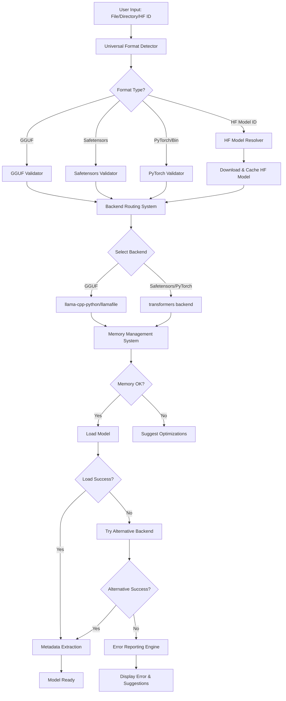

# Design Document

## Overview

The Universal Model Loader transforms the application into a comprehensive AI model loading system that supports all major model formats (GGUF, safetensors, PyTorch bin, Hugging Face) through intelligent backend selection and format detection. The design leverages existing backend infrastructure while adding format-aware loading, automatic backend matching, and seamless model management across different formats. This enables loading DeepSeek and other models regardless of their distribution format.

## Architecture

### Core Components

1. **Universal Format Detector** - Automatic detection of model formats (GGUF, safetensors, PyTorch, HF)
2. **Backend Routing System** - Intelligent backend selection based on format and capabilities
3. **Enhanced Model Validator** - Multi-format validation with version tolerance
4. **Hugging Face Integration** - Direct model loading from HF Hub with caching
5. **Memory Management System** - Proactive memory checking and optimization across formats
6. **Error Reporting Engine** - Comprehensive error analysis and user guidance
7. **Metadata Extraction Engine** - Robust metadata parsing for all supported formats

### Component Interactions



## Components and Interfaces

### Universal Format Detector

**Purpose:** Automatically detect and classify model formats from files, directories, or Hugging Face model IDs.

**Key Features:**
- File extension and header-based format detection
- Directory structure analysis for multi-file models
- Hugging Face model ID validation and resolution
- Format-specific validation routing

**Interface:**
```python
class UniversalFormatDetector:
    def detect_format(self, input_path: str) -> ModelFormat
    def validate_huggingface_id(self, model_id: str) -> HFValidationResult
    def analyze_directory_structure(self, dir_path: str) -> DirectoryAnalysis
    def get_format_validator(self, format_type: ModelFormat) -> FormatValidator
```

### Backend Routing System

**Purpose:** Intelligently route models to appropriate backends based on format, capabilities, and hardware.

**Key Features:**
- Format-to-backend mapping with fallback options
- Hardware-aware backend selection
- Backend capability assessment
- Automatic backend switching on failures

**Interface:**
```python
class BackendRoutingSystem:
    def get_optimal_backend(self, model_info: ModelInfo, hardware_info: HardwareInfo) -> BackendConfig
    def get_backend_for_format(self, format_type: ModelFormat) -> List[str]
    def assess_backend_capability(self, backend: str, model_info: ModelInfo) -> CapabilityScore
    def route_model_loading(self, model_info: ModelInfo) -> LoadingPlan
```

### Enhanced Model Validator

**Purpose:** Validate models across all supported formats with improved tolerance and error reporting.

**Key Features:**
- Multi-format validation (GGUF, safetensors, PyTorch, HF)
- Version-tolerant validation for each format
- Progressive validation with detailed error reporting
- Format-specific compatibility checks

**Interface:**
```python
class EnhancedModelValidator:
    def validate_model(self, file_path: str, format_type: ModelFormat) -> ValidationResult
    def validate_gguf(self, file_path: str) -> GGUFValidationResult
    def validate_safetensors(self, file_path: str) -> SafetensorsValidationResult
    def validate_pytorch(self, file_path: str) -> PyTorchValidationResult
    def validate_huggingface(self, model_path: str) -> HFValidationResult
```

### Hugging Face Integration

**Purpose:** Seamlessly integrate with Hugging Face Hub for direct model loading and management.

**Key Features:**
- Model ID resolution and validation
- Progressive download with caching
- Authentication token management
- Model versioning and updates

**Interface:**
```python
class HuggingFaceIntegration:
    def resolve_model_id(self, model_id: str) -> ModelResolution
    def download_model(self, model_id: str, cache_dir: str) -> DownloadResult
    def check_model_updates(self, model_id: str, local_path: str) -> UpdateStatus
    def authenticate(self, token: str) -> AuthResult
    def list_model_files(self, model_id: str) -> List[ModelFile]
```

### Memory Management System

**Purpose:** Proactively manage memory usage and prevent system instability.

**Key Features:**
- Pre-load memory estimation
- Dynamic memory monitoring
- Memory optimization suggestions
- Automatic parameter adjustment for memory constraints

**Interface:**
```python
class MemoryManagementSystem:
    def estimate_memory_requirements(self, model_path: str, backend: str) -> MemoryEstimate
    def check_memory_availability(self, required_memory: int) -> MemoryCheckResult
    def suggest_memory_optimizations(self, model_info: ModelInfo, available_memory: int) -> List[OptimizationSuggestion]
    def adjust_loading_parameters(self, config: BackendConfig, memory_constraints: MemoryConstraints) -> BackendConfig
```

### Error Reporting Engine

**Purpose:** Provide comprehensive error analysis and actionable user guidance.

**Key Features:**
- Root cause analysis for loading failures
- Context-aware error messages
- Actionable resolution suggestions
- Error categorization and severity assessment

**Interface:**
```python
class ErrorReportingEngine:
    def analyze_loading_error(self, error: Exception, context: LoadingContext) -> ErrorAnalysis
    def generate_user_message(self, error_analysis: ErrorAnalysis) -> UserErrorMessage
    def get_resolution_suggestions(self, error_type: ErrorType, context: LoadingContext) -> List[ResolutionSuggestion]
    def categorize_error(self, error: Exception) -> ErrorCategory
```

### Metadata Extraction Engine

**Purpose:** Robustly extract model metadata from all supported formats and sources.

**Key Features:**
- Multi-format metadata parsing (GGUF, safetensors, PyTorch, HF)
- Graceful degradation for unknown or incomplete metadata
- Parameter estimation and architecture detection
- Unified metadata representation across formats

**Interface:**
```python
class MetadataExtractionEngine:
    def extract_metadata(self, model_path: str, format_type: ModelFormat) -> UnifiedMetadata
    def parse_gguf_metadata(self, file_handle: BinaryIO) -> Dict[str, Any]
    def parse_safetensors_metadata(self, file_path: str) -> Dict[str, Any]
    def parse_pytorch_metadata(self, model_dir: str) -> Dict[str, Any]
    def parse_huggingface_metadata(self, model_path: str) -> Dict[str, Any]
    def unify_metadata(self, raw_metadata: Dict[str, Any], format_type: ModelFormat) -> UnifiedMetadata
```

## Data Models

### ModelFormat
```python
class ModelFormat(Enum):
    GGUF = "gguf"
    SAFETENSORS = "safetensors"
    PYTORCH_BIN = "pytorch_bin"
    HUGGINGFACE = "huggingface"
    UNKNOWN = "unknown"
```

### UnifiedMetadata
```python
@dataclass
class UnifiedMetadata:
    format_type: ModelFormat
    model_name: str
    architecture: str
    parameters: Optional[int]
    quantization: Optional[str]
    context_length: Optional[int]
    vocab_size: Optional[int]
    file_size: int
    tensor_info: Dict[str, Any]
    config: Dict[str, Any]
    tokenizer_info: Optional[Dict[str, Any]]
```

### ValidationResult
```python
@dataclass
class ValidationResult:
    is_valid: bool
    format_type: ModelFormat
    version: Optional[str]
    compatibility_mode: Optional[str]
    errors: List[ValidationError]
    warnings: List[ValidationWarning]
    file_info: FileInfo
    metadata: Optional[UnifiedMetadata]
```

### LoadingPlan
```python
@dataclass
class LoadingPlan:
    primary_backend: str
    fallback_backends: List[str]
    format_type: ModelFormat
    memory_requirements: MemoryEstimate
    optimization_suggestions: List[str]
    hardware_config: Dict[str, Any]
```

### LoadingResult (Enhanced)
```python
@dataclass
class LoadingResult:
    success: bool
    format_type: ModelFormat
    backend_used: str
    hardware_used: str
    load_time: float
    memory_usage: int
    error_message: Optional[str]
    model_info: UnifiedMetadata
    fallback_attempts: List[FallbackAttempt]
    optimization_applied: List[str]
    huggingface_cached: bool = False
```

### ErrorAnalysis
```python
@dataclass
class ErrorAnalysis:
    error_type: ErrorType
    severity: ErrorSeverity
    root_cause: str
    context: LoadingContext
    affected_components: List[str]
    resolution_suggestions: List[ResolutionSuggestion]
```

### MemoryEstimate
```python
@dataclass
class MemoryEstimate:
    base_model_size: int
    overhead_size: int
    total_estimated: int
    confidence_level: float
    optimization_potential: int
```

## Error Handling

### Error Categories

1. **Format Errors**
   - Invalid GGUF header
   - Corrupted file structure
   - Unsupported GGUF version

2. **Backend Errors**
   - Backend not available
   - Dependency missing
   - Hardware incompatibility

3. **Memory Errors**
   - Insufficient RAM/VRAM
   - Memory allocation failure
   - System memory pressure

4. **Hardware Errors**
   - GPU driver issues
   - CUDA/ROCm problems
   - Hardware acceleration failures

### Error Resolution Strategies

1. **Automatic Recovery**
   - Backend fallback
   - Parameter adjustment
   - Memory optimization

2. **User Guidance**
   - Installation instructions
   - Configuration recommendations
   - Alternative model suggestions

3. **Progressive Degradation**
   - CPU fallback for GPU failures
   - Reduced precision for memory issues
   - Basic loading for metadata failures

## Testing Strategy

### Unit Tests

1. **Model Validation Tests**
   - Valid GGUF files of different versions
   - Corrupted files and edge cases
   - Version compatibility scenarios

2. **Backend Fallback Tests**
   - Backend availability simulation
   - Loading failure scenarios
   - Priority ordering validation

3. **Memory Management Tests**
   - Memory estimation accuracy
   - Constraint handling
   - Optimization effectiveness

4. **Error Handling Tests**
   - Error categorization accuracy
   - Message generation quality
   - Resolution suggestion relevance

### Integration Tests

1. **End-to-End Loading Tests**
   - Various model types and sizes
   - Different hardware configurations
   - Multiple backend scenarios

2. **Error Recovery Tests**
   - Automatic fallback scenarios
   - Memory constraint handling
   - Hardware failure simulation

3. **Performance Tests**
   - Loading time benchmarks
   - Memory usage validation
   - Backend selection efficiency

### Compatibility Tests

1. **Model Format Tests**
   - DeepSeek models specifically
   - Various GGUF versions
   - Different model architectures

2. **Backend Compatibility Tests**
   - All supported backends
   - Hardware acceleration variants
   - Version compatibility matrix

3. **System Configuration Tests**
   - Different OS environments
   - Various hardware setups
   - Memory constraint scenarios

## Performance Considerations

### Loading Optimization

1. **Lazy Loading**
   - Load metadata first
   - Progressive model loading
   - On-demand component initialization

2. **Memory Efficiency**
   - Memory mapping where possible
   - Streaming for large models
   - Garbage collection optimization

3. **Caching Strategy**
   - Backend availability cache
   - Model metadata cache
   - Hardware capability cache

### Scalability

1. **Large Model Support**
   - Chunked loading for very large models
   - Memory pressure monitoring
   - Dynamic parameter adjustment

2. **Multi-Backend Management**
   - Concurrent backend testing
   - Parallel fallback attempts
   - Resource sharing optimization

3. **Error Recovery Performance**
   - Fast failure detection
   - Efficient fallback switching
   - Minimal retry overhead