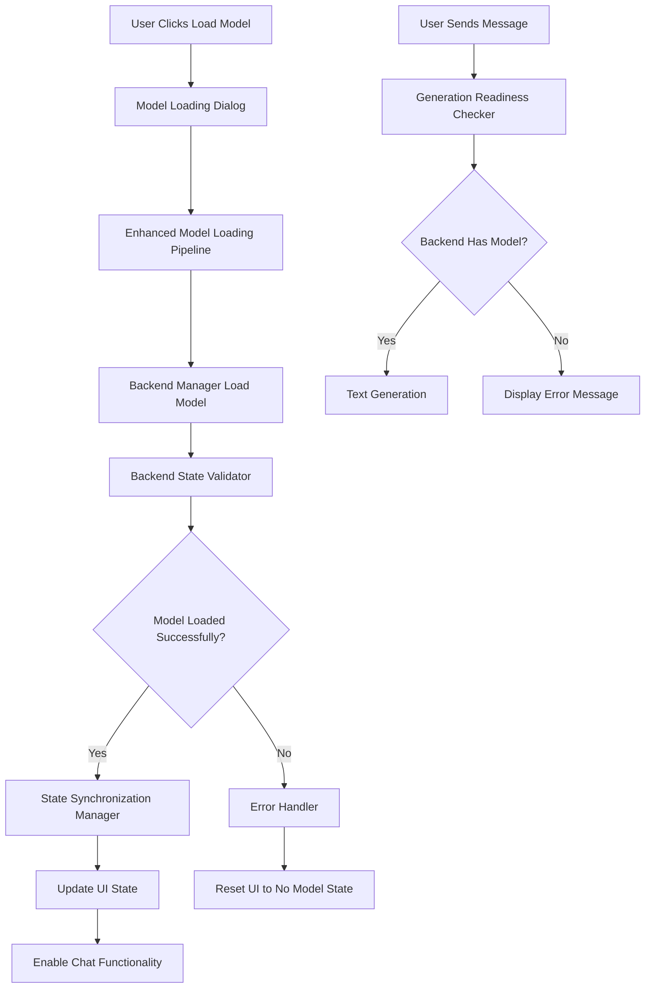

# Model Backend Synchronization Design

## Overview

The model backend synchronization system addresses the critical disconnect between UI state and actual backend model loading. The current issue is that the UI shows a model as loaded while the backend manager has no current_backend, resulting in failed text generation attempts.

The solution involves implementing proper state validation, enhanced model loading workflows, and robust synchronization mechanisms between the UI and backend components.

## Architecture

### Core Components

1. **Backend State Validator**: Validates that backend manager state matches UI state
2. **Enhanced Model Loading Pipeline**: Ensures models are properly loaded into backend manager
3. **State Synchronization Manager**: Keeps UI and backend states synchronized
4. **Generation Readiness Checker**: Verifies system is ready for text generation

### Component Interactions



## Components and Interfaces

### 1. Backend State Validator

**Purpose**: Validates that the backend manager actually has a loaded model when the UI claims one is loaded.

**Interface**:
```python
class BackendStateValidator:
    def validate_model_loaded(self, backend_manager) -> Tuple[bool, str]
    def validate_generation_ready(self, backend_manager) -> Tuple[bool, str]
    def get_backend_status_report(self, backend_manager) -> Dict[str, Any]
```

**Key Methods**:
- `validate_model_loaded()`: Checks if backend_manager.current_backend exists and has a model
- `validate_generation_ready()`: Verifies the model can actually generate text
- `get_backend_status_report()`: Provides detailed status information for debugging

### 2. Enhanced Model Loading Pipeline

**Purpose**: Ensures models are properly loaded into the backend manager with full validation.

**Interface**:
```python
class EnhancedModelLoadingPipeline:
    def load_model_with_validation(self, file_path: str) -> ModelLoadingResult
    def verify_model_in_backend(self, backend_manager) -> bool
    def test_generation_capability(self, backend_manager) -> bool
```

**Loading Process**:
1. Validate model file exists and is readable
2. Load model using backend manager's optimized loading
3. Verify model is actually loaded in backend_manager.current_backend
4. Test basic text generation capability
5. Update UI state only after full validation

### 3. State Synchronization Manager

**Purpose**: Keeps UI state synchronized with actual backend manager state.

**Interface**:
```python
class StateSynchronizationManager:
    def sync_ui_with_backend(self, backend_manager, ui_components)
    def handle_backend_state_change(self, event_data)
    def update_model_dropdown(self, model_info)
    def update_chat_readiness(self, is_ready: bool)
```

**Synchronization Events**:
- `backend.model.loaded`: Backend successfully loaded a model
- `backend.model.unloaded`: Backend unloaded a model
- `backend.state.changed`: Backend state changed
- `ui.sync.requested`: UI requested state synchronization

### 4. Generation Readiness Checker

**Purpose**: Verifies the system is ready for text generation before attempting it.

**Interface**:
```python
class GenerationReadinessChecker:
    def check_generation_readiness(self, backend_manager) -> Tuple[bool, str]
    def validate_backend_connection(self, backend_manager) -> bool
    def test_simple_generation(self, backend_manager) -> bool
```

**Readiness Checks**:
1. Backend manager exists and is initialized
2. Current backend is not None
3. Current backend has a loaded model
4. Model can perform basic text generation

## Data Models

### ModelLoadingResult

```python
@dataclass
class ModelLoadingResult:
    success: bool
    model_path: str
    backend_used: str
    load_time: float
    error_message: Optional[str]
    backend_validated: bool
    generation_tested: bool
    ui_updated: bool
```

### BackendStateReport

```python
@dataclass
class BackendStateReport:
    has_backend_manager: bool
    has_current_backend: bool
    backend_type: Optional[str]
    model_loaded: bool
    model_path: Optional[str]
    generation_ready: bool
    last_validation_time: datetime
    error_details: Optional[str]
```

### SynchronizationEvent

```python
@dataclass
class SynchronizationEvent:
    event_type: str
    source: str  # 'backend' or 'ui'
    data: Dict[str, Any]
    timestamp: datetime
    requires_ui_update: bool
```

## Error Handling

### Error Categories

1. **Model Loading Errors**:
   - File not found or unreadable
   - Backend manager initialization failure
   - Model loading into backend failure
   - Post-load validation failure

2. **State Synchronization Errors**:
   - UI state doesn't match backend state
   - Event system communication failure
   - State update propagation failure

3. **Generation Readiness Errors**:
   - No backend manager available
   - No current backend loaded
   - Model loaded but not functional
   - Generation test failure

### Error Recovery Strategies

1. **Automatic Recovery**:
   - Retry model loading with different backends
   - Re-synchronize UI state with backend
   - Clear inconsistent state and reset

2. **User-Guided Recovery**:
   - Display clear error messages with suggested actions
   - Provide "Reload Model" option
   - Show backend status information

3. **Graceful Degradation**:
   - Disable chat functionality when no model is ready
   - Show appropriate status messages
   - Maintain application stability

## Testing Strategy

### Unit Tests

1. **Backend State Validator Tests**:
   - Test validation with no backend manager
   - Test validation with backend manager but no current backend
   - Test validation with loaded model
   - Test generation readiness checking

2. **Model Loading Pipeline Tests**:
   - Test loading with valid GGUF file
   - Test loading with invalid file
   - Test backend validation after loading
   - Test generation capability testing

3. **State Synchronization Tests**:
   - Test UI update after successful model loading
   - Test UI reset after model loading failure
   - Test event-driven synchronization
   - Test state consistency validation

### Integration Tests

1. **End-to-End Model Loading**:
   - Load model through UI and verify backend state
   - Test text generation after model loading
   - Test error handling for failed loads

2. **State Synchronization Integration**:
   - Test UI updates when backend state changes
   - Test backend updates when UI actions occur
   - Test event system integration

3. **Error Recovery Integration**:
   - Test recovery from model loading failures
   - Test recovery from state synchronization issues
   - Test graceful degradation scenarios

### Manual Testing Scenarios

1. **Happy Path Testing**:
   - Load model and verify chat works
   - Send messages and receive responses
   - Unload model and verify UI updates

2. **Error Path Testing**:
   - Try to chat with no model loaded
   - Load invalid model file
   - Simulate backend manager failure

3. **State Consistency Testing**:
   - Restart application and verify state
   - Load multiple models sequentially
   - Test concurrent operations

## Implementation Notes

### Key Integration Points

1. **MainWindow Integration**:
   - Update `_load_model_optimized()` to use enhanced pipeline
   - Modify `check_chat_readiness()` to use validation
   - Integrate state synchronization manager

2. **Backend Manager Integration**:
   - Add validation hooks to model loading process
   - Implement state change event emission
   - Add generation readiness testing

3. **Chat Tab Integration**:
   - Update message sending to check readiness
   - Add better error message display
   - Integrate with state synchronization

### Performance Considerations

1. **Validation Overhead**:
   - Cache validation results to avoid repeated checks
   - Use lightweight validation for frequent operations
   - Implement async validation for heavy operations

2. **State Synchronization**:
   - Use event-driven updates to minimize polling
   - Batch UI updates to reduce flicker
   - Implement debouncing for rapid state changes

3. **Error Recovery**:
   - Implement exponential backoff for retries
   - Use circuit breaker pattern for failing operations
   - Cache error states to avoid repeated failures