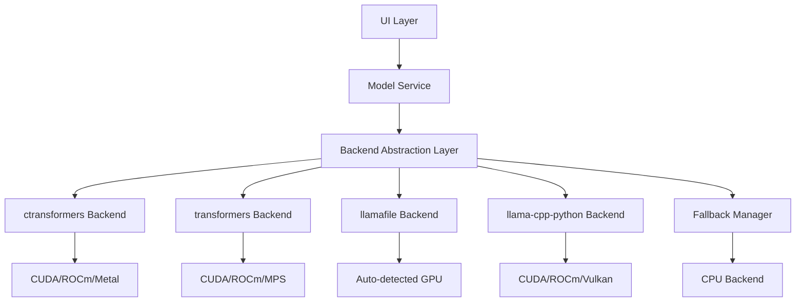

# Design Document

## Overview

This design outlines the migration from the problematic llama-cpp-python backend to a more reliable, abstracted backend system that supports multiple GPU-accelerated inference engines. The new architecture will provide better installation reliability, improved GPU support across different hardware vendors, and easier maintenance through a pluggable backend system.

## Architecture

### Current Architecture Issues

The current implementation has several problems:
- Direct dependency on llama-cpp-python with complex CUDA compilation requirements
- Hardcoded backend logic in the GGUFModel class
- No fallback mechanisms when GPU installation fails
- Limited hardware vendor support (NVIDIA-focused)
- Difficult troubleshooting and debugging

### New Architecture Overview



The new architecture introduces:
1. **Backend Abstraction Layer**: Common interface for all inference backends
2. **Multiple Backend Options**: Support for different inference engines
3. **Automatic Fallback**: Graceful degradation when GPU backends fail
4. **Hardware Detection**: Automatic detection and optimization for available hardware
5. **Configuration Management**: Easy switching between backends

## Components and Interfaces

### 1. Backend Interface

```python
class ModelBackend(ABC):
    """Abstract base class for model backends."""
    
    @abstractmethod
    def load_model(self, model_path: str, **kwargs) -> bool:
        """Load a model from the given path."""
        pass
    
    @abstractmethod
    def generate_text(self, prompt: str, **kwargs) -> str:
        """Generate text from the given prompt."""
        pass
    
    @abstractmethod
    def unload_model(self) -> bool:
        """Unload the current model."""
        pass
    
    @abstractmethod
    def get_hardware_info(self) -> Dict[str, Any]:
        """Get information about hardware acceleration."""
        pass
    
    @abstractmethod
    def is_available(self) -> bool:
        """Check if this backend is available on the system."""
        pass
```

### 2. Backend Implementations

#### ctransformers Backend (Primary Choice)
- **Pros**: Easy installation, good GPU support, reliable wheels
- **Cons**: Limited to specific model formats
- **Installation**: `pip install ctransformers[cuda]` (much more reliable)
- **GPU Support**: CUDA, ROCm, Metal (macOS)

#### transformers + accelerate Backend
- **Pros**: Excellent GPU support, active development, broad model support
- **Cons**: Larger dependency footprint, may require model conversion
- **Installation**: `pip install transformers accelerate torch`
- **GPU Support**: CUDA, ROCm, MPS (Apple Silicon)

#### llamafile Backend
- **Pros**: Single executable, automatic GPU detection, no Python dependencies
- **Cons**: External process management, limited customization
- **Installation**: Download single executable
- **GPU Support**: Automatic detection and optimization

#### llama-cpp-python Backend (Fallback)
- **Pros**: Direct GGUF support, good performance
- **Cons**: Installation issues (current problem)
- **Installation**: Complex compilation requirements
- **GPU Support**: CUDA, ROCm, Vulkan, Metal

### 3. Backend Manager

```python
class BackendManager:
    """Manages available backends and handles fallback logic."""
    
    def __init__(self):
        self.backends = {}
        self.current_backend = None
        self.fallback_order = [
            'ctransformers',
            'transformers', 
            'llamafile',
            'llama-cpp-python'
        ]
    
    def detect_available_backends(self) -> List[str]:
        """Detect which backends are available on the system."""
        pass
    
    def get_best_backend(self, hardware_preference: str = 'auto') -> str:
        """Get the best available backend for the given hardware."""
        pass
    
    def switch_backend(self, backend_name: str) -> bool:
        """Switch to a different backend."""
        pass
```

### 4. Hardware Detection

```python
class HardwareDetector:
    """Detects available hardware and recommends optimal settings."""
    
    def detect_gpus(self) -> List[Dict[str, Any]]:
        """Detect available GPUs and their capabilities."""
        pass
    
    def get_optimal_settings(self, backend: str, model_size: int) -> Dict[str, Any]:
        """Get optimal settings for the given backend and model size."""
        pass
    
    def benchmark_backend(self, backend: str) -> Dict[str, float]:
        """Benchmark a backend's performance."""
        pass
```

## Data Models

### Backend Configuration

```python
@dataclass
class BackendConfig:
    """Configuration for a specific backend."""
    name: str
    enabled: bool
    priority: int
    gpu_enabled: bool
    gpu_layers: int
    context_size: int
    batch_size: int
    custom_args: Dict[str, Any]
```

### Hardware Information

```python
@dataclass
class HardwareInfo:
    """Information about available hardware."""
    gpu_count: int
    gpu_devices: List[Dict[str, Any]]
    total_vram: int
    cpu_cores: int
    total_ram: int
    recommended_backend: str
```

### Model Loading Result

```python
@dataclass
class LoadingResult:
    """Result of model loading operation."""
    success: bool
    backend_used: str
    hardware_used: str
    load_time: float
    memory_usage: int
    error_message: Optional[str]
```

## Error Handling

### Fallback Strategy

1. **Primary Backend Failure**: Try next backend in priority order
2. **GPU Failure**: Fall back to CPU mode with same backend
3. **Complete Backend Failure**: Fall back to next available backend
4. **All Backends Failed**: Provide clear error message and installation guidance

### Error Categories

```python
class BackendError(Exception):
    """Base class for backend errors."""
    pass

class InstallationError(BackendError):
    """Backend installation or dependency issues."""
    pass

class HardwareError(BackendError):
    """Hardware acceleration issues."""
    pass

class ModelLoadingError(BackendError):
    """Model loading specific issues."""
    pass
```

## Testing Strategy

### Unit Tests
- Backend interface compliance tests
- Hardware detection accuracy tests
- Fallback mechanism tests
- Configuration validation tests

### Integration Tests
- End-to-end model loading tests
- Cross-backend compatibility tests
- Performance comparison tests
- GPU acceleration verification tests

### Performance Tests
- Loading time benchmarks
- Memory usage comparisons
- Inference speed tests
- Hardware utilization tests

### Mock Testing
- Simulate hardware configurations
- Test error conditions
- Validate fallback behavior
- Test installation scenarios

## Implementation Plan

### Phase 1: Backend Abstraction
1. Create backend interface and base classes
2. Implement hardware detection utilities
3. Create backend manager with fallback logic
4. Add configuration management

### Phase 2: Backend Implementations
1. Implement ctransformers backend (primary)
2. Implement transformers backend
3. Implement llamafile backend
4. Refactor existing llama-cpp-python backend

### Phase 3: Integration
1. Update GGUFModel to use backend abstraction
2. Modify model service to support backend switching
3. Add UI controls for backend selection
4. Implement monitoring and diagnostics

### Phase 4: Testing and Optimization
1. Comprehensive testing across all backends
2. Performance optimization
3. Documentation and user guides
4. Migration tools for existing installations

## Migration Strategy

### Backward Compatibility
- Existing models will continue to work
- Configuration migration for existing users
- Gradual deprecation of direct llama-cpp-python usage

### User Experience
- Automatic backend detection and recommendation
- Clear status indicators for GPU acceleration
- Easy backend switching through UI
- Detailed error messages with solutions

### Installation Improvements
- Simplified setup scripts for each backend
- Automatic dependency management
- Clear installation instructions
- Troubleshooting guides

## Performance Considerations

### Memory Management
- Efficient model loading across backends
- Memory usage monitoring and optimization
- Automatic memory cleanup on backend switches

### GPU Utilization
- Optimal GPU layer distribution
- Dynamic GPU memory allocation
- Multi-GPU support where available

### Caching and Optimization
- Backend-specific optimization caches
- Model metadata caching
- Hardware capability caching

## Security Considerations

### Dependency Management
- Verify backend package integrity
- Regular security updates
- Minimal dependency footprint

### Model Loading
- Validate model files before loading
- Sandboxed execution where possible
- Resource usage limits

## Monitoring and Diagnostics

### Performance Metrics
- Loading times per backend
- Memory usage tracking
- GPU utilization monitoring
- Error rate tracking

### Diagnostic Tools
- Backend availability checker
- Hardware compatibility tester
- Performance benchmarking tools
- Configuration validator

### Logging and Debugging
- Detailed backend operation logs
- Hardware detection logs
- Performance profiling data
- Error tracking and reporting