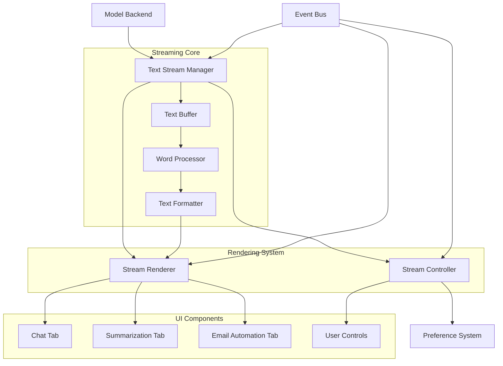

# Design Document

## Overview

This design implements a word-by-word streaming text output system that provides clean, readable text delivery without overwhelming the model or creating performance bottlenecks. The system uses a buffered streaming approach with intelligent rate limiting, proper text formatting, and consistent user experience across all text-generating features in the application.

## Architecture

### High-Level Architecture



### Component Flow

1. **Model Backend** generates tokens and sends them to Text Stream Manager
2. **Text Stream Manager** coordinates the entire streaming pipeline
3. **Text Buffer** accumulates tokens and manages word boundaries
4. **Word Processor** handles word completion and formatting
5. **Text Formatter** ensures clean spacing and proper formatting
6. **Stream Renderer** displays words progressively in UI components
7. **Stream Controller** manages user interactions and preferences

## Components and Interfaces

### 1. Text Stream Manager

#### Core Interface
```python
class TextStreamManager(QObject):
    """
    Central coordinator for streaming text output across all features.
    Manages multiple concurrent streams and ensures consistent behavior.
    """
    
    # Signals
    stream_started = Signal(str)  # stream_id
    word_ready = Signal(str, str)  # stream_id, word
    stream_paused = Signal(str)  # stream_id
    stream_resumed = Signal(str)  # stream_id
    stream_completed = Signal(str)  # stream_id
    stream_error = Signal(str, str)  # stream_id, error_message
    
    def __init__(self, event_bus: EventBus, parent=None):
        super().__init__(parent)
        self.event_bus = event_bus
        self.active_streams: Dict[str, StreamContext] = {}
        self.stream_settings = StreamSettings()
        self.word_processor = WordProcessor()
        self.text_formatter = TextFormatter()
        
    def create_stream(self, stream_id: str, target_widget: QWidget, 
                     stream_config: StreamConfig) -> StreamContext:
        """Create a new text stream for a specific UI component."""
        
    def process_token(self, stream_id: str, token: str):
        """Process incoming token from model backend."""
        
    def pause_stream(self, stream_id: str):
        """Pause streaming for specific stream."""
        
    def resume_stream(self, stream_id: str):
        """Resume streaming for specific stream."""
        
    def stop_stream(self, stream_id: str):
        """Stop and cleanup specific stream."""
        
    def update_stream_settings(self, settings: StreamSettings):
        """Update global streaming settings."""
```

#### Stream Context Data Structure
```python
@dataclass
class StreamContext:
    """Context information for an active text stream."""
    stream_id: str
    target_widget: QWidget
    config: StreamConfig
    buffer: TextBuffer
    renderer: StreamRenderer
    state: StreamState
    created_at: float
    last_update: float
    total_words: int
    current_position: int
    is_paused: bool
    error_count: int
    
    def get_progress_percentage(self) -> float:
        """Calculate streaming progress percentage."""
        if self.total_words == 0:
            return 0.0
        return (self.current_position / self.total_words) * 100
```

### 2. Text Buffer and Word Processing

#### Text Buffer
```python
class TextBuffer:
    """
    Intelligent buffer for accumulating tokens and managing word boundaries.
    Handles proper word completion and spacing.
    """
    
    def __init__(self, config: StreamConfig):
        self.config = config
        self.token_buffer: List[str] = []
        self.completed_words: List[str] = []
        self.current_word_tokens: List[str] = []
        self.pending_space = False
        
    def add_token(self, token: str) -> Optional[str]:
        """
        Add token to buffer and return completed word if available.
        Returns None if word is not yet complete.
        """
        # Handle special tokens and word boundaries
        if self._is_word_boundary(token):
            if self.current_word_tokens:
                completed_word = self._complete_current_word()
                self.current_word_tokens.clear()
                return completed_word
        else:
            self.current_word_tokens.append(token)
            
        return None
        
    def _is_word_boundary(self, token: str) -> bool:
        """Determine if token represents a word boundary."""
        return token in [' ', '\n', '\t', '.', ',', '!', '?', ';', ':']
        
    def _complete_current_word(self) -> str:
        """Complete current word from accumulated tokens."""
        word = ''.join(self.current_word_tokens).strip()
        if self.pending_space and word:
            word = ' ' + word
            self.pending_space = False
        return word
        
    def flush_remaining(self) -> str:
        """Flush any remaining tokens as final word."""
        if self.current_word_tokens:
            return self._complete_current_word()
        return ""
```

#### Word Processor
```python
class WordProcessor:
    """
    Processes completed words for proper formatting and spacing.
    Ensures clean text output without extra spaces or formatting issues.
    """
    
    def __init__(self):
        self.last_word_ended_with_space = False
        self.sentence_start = True
        
    def process_word(self, word: str, context: ProcessingContext) -> ProcessedWord:
        """
        Process word for proper formatting and spacing.
        Returns ProcessedWord with formatting information.
        """
        processed = ProcessedWord(
            original=word,
            formatted=self._format_word(word),
            needs_space_before=self._needs_space_before(word),
            needs_space_after=self._needs_space_after(word),
            is_punctuation=self._is_punctuation(word),
            starts_sentence=self.sentence_start
        )
        
        # Update state for next word
        self._update_state(processed)
        
        return processed
        
    def _format_word(self, word: str) -> str:
        """Apply proper formatting to word."""
        # Remove extra whitespace
        formatted = ' '.join(word.split())
        
        # Handle capitalization for sentence starts
        if self.sentence_start and formatted and formatted[0].isalpha():
            formatted = formatted[0].upper() + formatted[1:]
            
        return formatted
        
    def _needs_space_before(self, word: str) -> bool:
        """Determine if word needs space before it."""
        if not word:
            return False
            
        # No space before punctuation
        if word.strip() in '.,!?;:':
            return False
            
        # No space at start of sentence
        if self.sentence_start:
            return False
            
        return True
        
    def _update_state(self, processed: ProcessedWord):
        """Update processor state after processing word."""
        if processed.is_punctuation and processed.formatted.strip() in '.!?':
            self.sentence_start = True
        else:
            self.sentence_start = False
```

### 3. Stream Renderer

#### Core Renderer
```python
class StreamRenderer(QObject):
    """
    Renders processed words to UI components with smooth animations.
    Handles different widget types and maintains consistent appearance.
    """
    
    def __init__(self, target_widget: QWidget, config: StreamConfig, parent=None):
        super().__init__(parent)
        self.target_widget = target_widget
        self.config = config
        self.animation_timer = QTimer()
        self.animation_timer.timeout.connect(self._animate_next_word)
        self.word_queue: Queue[ProcessedWord] = Queue()
        self.typing_indicator = TypingIndicator(target_widget)
        
    def queue_word(self, processed_word: ProcessedWord):
        """Queue processed word for rendering."""
        self.word_queue.put(processed_word)
        if not self.animation_timer.isActive():
            self._start_rendering()
            
    def _start_rendering(self):
        """Start the word-by-word rendering process."""
        self.typing_indicator.show()
        self.animation_timer.start(self.config.word_delay_ms)
        
    def _animate_next_word(self):
        """Render next word in queue with smooth animation."""
        if self.word_queue.empty():
            self._finish_rendering()
            return
            
        word = self.word_queue.get()
        self._render_word_to_widget(word)
        
    def _render_word_to_widget(self, word: ProcessedWord):
        """Render word to specific widget type."""
        if isinstance(self.target_widget, QTextEdit):
            self._render_to_text_edit(word)
        elif isinstance(self.target_widget, QLabel):
            self._render_to_label(word)
        else:
            self._render_to_generic_widget(word)
            
    def _render_to_text_edit(self, word: ProcessedWord):
        """Render word to QTextEdit with proper formatting."""
        cursor = self.target_widget.textCursor()
        cursor.movePosition(QTextCursor.End)
        
        # Add space if needed
        if word.needs_space_before and not cursor.atStart():
            cursor.insertText(' ')
            
        # Insert formatted word
        cursor.insertText(word.formatted)
        
        # Ensure cursor is visible
        self.target_widget.ensureCursorVisible()
        
    def _finish_rendering(self):
        """Complete rendering process and cleanup."""
        self.animation_timer.stop()
        self.typing_indicator.hide()
        self.stream_completed.emit()
```

### 4. User Controls and Preferences

#### Stream Controller
```python
class StreamController(QObject):
    """
    Manages user interactions with streaming system.
    Handles pause/resume, speed control, and preferences.
    """
    
    # Signals
    pause_requested = Signal(str)  # stream_id
    resume_requested = Signal(str)  # stream_id
    speed_changed = Signal(int)  # new_delay_ms
    streaming_disabled = Signal()
    
    def __init__(self, parent=None):
        super().__init__(parent)
        self.preferences = StreamPreferences()
        self.control_widgets: Dict[str, StreamControlWidget] = {}
        
    def create_controls_for_stream(self, stream_id: str, 
                                 parent_widget: QWidget) -> StreamControlWidget:
        """Create control widget for specific stream."""
        controls = StreamControlWidget(stream_id, self.preferences, parent_widget)
        controls.pause_clicked.connect(lambda: self.pause_requested.emit(stream_id))
        controls.resume_clicked.connect(lambda: self.resume_requested.emit(stream_id))
        controls.speed_changed.connect(self.speed_changed.emit)
        
        self.control_widgets[stream_id] = controls
        return controls
        
    def remove_controls_for_stream(self, stream_id: str):
        """Remove and cleanup controls for stream."""
        if stream_id in self.control_widgets:
            self.control_widgets[stream_id].deleteLater()
            del self.control_widgets[stream_id]
```

#### Stream Control Widget
```python
class StreamControlWidget(QWidget):
    """
    UI widget providing user controls for streaming.
    Includes pause/resume, speed control, and copy functionality.
    """
    
    # Signals
    pause_clicked = Signal()
    resume_clicked = Signal()
    speed_changed = Signal(int)
    copy_requested = Signal()
    
    def __init__(self, stream_id: str, preferences: StreamPreferences, parent=None):
        super().__init__(parent)
        self.stream_id = stream_id
        self.preferences = preferences
        self.is_paused = False
        self._init_ui()
        
    def _init_ui(self):
        """Initialize control UI elements."""
        layout = QHBoxLayout(self)
        layout.setContentsMargins(5, 5, 5, 5)
        
        # Pause/Resume button
        self.pause_resume_btn = QPushButton("⏸️")
        self.pause_resume_btn.setToolTip("Pause/Resume streaming")
        self.pause_resume_btn.clicked.connect(self._toggle_pause_resume)
        layout.addWidget(self.pause_resume_btn)
        
        # Speed control
        speed_label = QLabel("Speed:")
        layout.addWidget(speed_label)
        
        self.speed_slider = QSlider(Qt.Horizontal)
        self.speed_slider.setRange(50, 1000)  # 50ms to 1000ms delay
        self.speed_slider.setValue(self.preferences.word_delay_ms)
        self.speed_slider.valueChanged.connect(self.speed_changed.emit)
        layout.addWidget(self.speed_slider)
        
        # Copy button
        copy_btn = QPushButton("📋")
        copy_btn.setToolTip("Copy current text")
        copy_btn.clicked.connect(self.copy_requested.emit)
        layout.addWidget(copy_btn)
        
    def _toggle_pause_resume(self):
        """Toggle between pause and resume states."""
        if self.is_paused:
            self.pause_resume_btn.setText("⏸️")
            self.pause_resume_btn.setToolTip("Pause streaming")
            self.resume_clicked.emit()
        else:
            self.pause_resume_btn.setText("▶️")
            self.pause_resume_btn.setToolTip("Resume streaming")
            self.pause_clicked.emit()
            
        self.is_paused = not self.is_paused
```

### 5. Visual Feedback Components

#### Typing Indicator
```python
class TypingIndicator(QWidget):
    """
    Visual indicator showing that text is being generated.
    Provides animated cursor or dots to indicate active streaming.
    """
    
    def __init__(self, parent=None):
        super().__init__(parent)
        self.animation_timer = QTimer()
        self.animation_timer.timeout.connect(self._animate)
        self.animation_frame = 0
        self.setFixedSize(20, 20)
        
    def show(self):
        """Show typing indicator with animation."""
        super().show()
        self.animation_timer.start(500)  # 500ms animation cycle
        
    def hide(self):
        """Hide typing indicator and stop animation."""
        self.animation_timer.stop()
        super().hide()
        
    def paintEvent(self, event):
        """Paint animated typing indicator."""
        painter = QPainter(self)
        painter.setRenderHint(QPainter.Antialiasing)
        
        # Draw animated dots
        dot_positions = [(5, 10), (10, 10), (15, 10)]
        for i, (x, y) in enumerate(dot_positions):
            opacity = 0.3 + 0.7 * ((self.animation_frame + i) % 3 == 0)
            painter.setOpacity(opacity)
            painter.setBrush(QBrush(QColor(100, 100, 100)))
            painter.drawEllipse(x-2, y-2, 4, 4)
            
    def _animate(self):
        """Update animation frame."""
        self.animation_frame = (self.animation_frame + 1) % 3
        self.update()
```

## Data Models

### Configuration and Settings
```python
@dataclass
class StreamConfig:
    """Configuration for individual stream behavior."""
    word_delay_ms: int = 150  # Delay between words
    enable_animations: bool = True
    show_typing_indicator: bool = True
    auto_scroll: bool = True
    buffer_size: int = 100
    max_concurrent_words: int = 5
    
@dataclass
class StreamSettings:
    """Global streaming system settings."""
    enabled: bool = True
    default_word_delay: int = 150
    max_concurrent_streams: int = 10
    error_retry_attempts: int = 3
    buffer_overflow_strategy: str = "drop_oldest"
    
@dataclass
class ProcessedWord:
    """Processed word with formatting information."""
    original: str
    formatted: str
    needs_space_before: bool
    needs_space_after: bool
    is_punctuation: bool
    starts_sentence: bool
    timestamp: float = field(default_factory=time.time)
```

### State Management
```python
class StreamState(Enum):
    """Possible states for text streams."""
    CREATED = "created"
    ACTIVE = "active"
    PAUSED = "paused"
    BUFFERING = "buffering"
    ERROR = "error"
    COMPLETED = "completed"
    CANCELLED = "cancelled"
```

## Error Handling

### Error Recovery System
```python
class StreamErrorHandler:
    """Handles errors in streaming system with graceful recovery."""
    
    def __init__(self, event_bus: EventBus):
        self.event_bus = event_bus
        self.error_counts: Dict[str, int] = {}
        self.max_retries = 3
        
    def handle_stream_error(self, stream_id: str, error: Exception, 
                          context: StreamContext) -> ErrorAction:
        """Handle streaming error with appropriate recovery action."""
        self.error_counts[stream_id] = self.error_counts.get(stream_id, 0) + 1
        
        if self.error_counts[stream_id] <= self.max_retries:
            return ErrorAction.RETRY
        elif isinstance(error, NetworkError):
            return ErrorAction.FALLBACK_TO_BATCH
        else:
            return ErrorAction.DISPLAY_ERROR
            
    def reset_error_count(self, stream_id: str):
        """Reset error count for successful stream."""
        self.error_counts.pop(stream_id, None)
```

## Testing Strategy

### Unit Tests
- Test word boundary detection and completion
- Test text formatting and spacing logic
- Test streaming rate limiting and buffering
- Test user control interactions
- Test error handling and recovery

### Integration Tests
- Test streaming across different UI components
- Test concurrent streaming scenarios
- Test pause/resume functionality
- Test preference persistence
- Test performance under load

### Performance Tests
- Test streaming with large text volumes
- Test memory usage during long streams
- Test UI responsiveness during streaming
- Test concurrent stream performance
- Test error recovery performance

### User Experience Tests
- Test word-by-word display smoothness
- Test visual feedback clarity
- Test control responsiveness
- Test text readability and formatting
- Test overall streaming experience