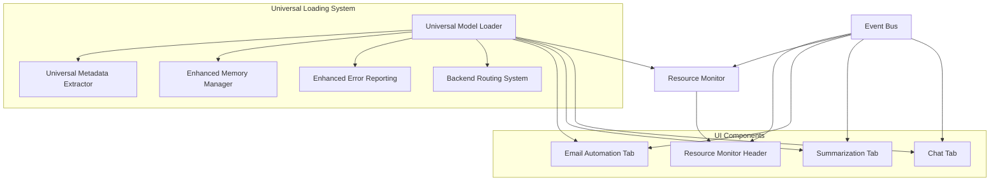

# Design Document

## Overview

This design integrates the chat, summarization, and email automation tabs with the new universal model loading system. The integration will provide enhanced model support, intelligent backend routing, comprehensive error handling, and real-time resource monitoring. The design maintains backward compatibility while adding new capabilities through the universal loading pipeline.

## Architecture

### High-Level Architecture



### Component Integration Flow

1. **Universal Model Loader** orchestrates the entire loading pipeline
2. **Resource Monitor** tracks system usage and provides real-time updates
3. **Event Bus** facilitates communication between components
4. **Tabs** receive enhanced model information and adapt their interfaces
5. **Resource Monitor Header** displays live system metrics

## Components and Interfaces

### 1. Enhanced Event System

#### New Event Types
```python
# Enhanced model events
"universal.model.loading_started"     # (model_path, loading_plan)
"universal.model.progress_updated"    # (progress_info)
"universal.model.format_detected"     # (model_path, format_type, metadata)
"universal.model.backend_selected"    # (backend_name, reason, confidence)
"universal.model.loaded"              # (loading_result)
"universal.model.loading_failed"      # (error_message, error_analysis)
"universal.model.unloaded"            # (model_path, cleanup_info)

# Resource monitoring events
"resource.monitor.started"            # ()
"resource.monitor.updated"            # (system_metrics)
"resource.monitor.gpu_requested"      # ()
"resource.monitor.gpu_data"           # (gpu_metrics)
"resource.monitor.stopped"            # ()

# Performance events
"performance.metrics_updated"         # (performance_data)
"performance.warning"                 # (warning_type, details)
"performance.optimization_suggested"  # (suggestion_type, details)
```

#### Event Data Structures
```python
@dataclass
class UniversalLoadingProgress:
    stage: LoadingStage
    progress: int  # 0-100
    message: str
    details: Optional[str]
    elapsed_time: float
    estimated_remaining: Optional[float]
    backend_info: Optional[str]
    memory_usage: Optional[int]

@dataclass
class UniversalModelInfo:
    model_path: str
    format_type: ModelFormat
    backend_used: str
    hardware_used: str
    metadata: UnifiedMetadata
    capabilities: List[str]
    performance_metrics: Dict[str, Any]
    memory_usage: int
    optimization_applied: List[str]

@dataclass
class ResourceMetrics:
    timestamp: float
    cpu_usage: float
    memory_usage: int
    memory_total: int
    backend_name: Optional[str]
    model_active: bool
    gpu_available: bool
```

### 2. Resource Monitor Header Component

#### Interface Design
```python
class ResourceMonitorHeader(QWidget):
    """
    Resource monitoring header that displays real-time system metrics.
    Positioned below the model loading section with matching width.
    """
    
    # Signals
    gpu_details_requested = Signal()
    
    def __init__(self, event_bus: EventBus, parent=None):
        super().__init__(parent)
        self.event_bus = event_bus
        self.update_timer = QTimer()
        self.update_timer.timeout.connect(self._update_metrics)
        self.update_timer.setInterval(2000)  # 2 seconds
        
    def show_model_loaded(self, model_info: UniversalModelInfo):
        """Show header when model is loaded."""
        
    def hide_model_unloaded(self):
        """Hide header when model is unloaded."""
        
    def _update_metrics(self):
        """Update CPU and RAM metrics every 2 seconds."""
        
    def _show_gpu_details(self):
        """Show GPU usage details dialog."""
```

#### UI Layout
```
┌─────────────────────────────────────────────────────────┐
│ Backend: llama-cpp-python | RAM: 4.2GB/16GB | CPU: 45% │
│                                          [GPU Details]  │
└─────────────────────────────────────────────────────────┘
```

### 3. Enhanced Tab Integration

#### Chat Tab Enhancements
```python
class EnhancedChatTab(ChatTab):
    """Enhanced chat tab with universal model loading integration."""
    
    def __init__(self, event_bus: EventBus, parent=None):
        super().__init__(event_bus, parent)
        self.current_model_info: Optional[UniversalModelInfo] = None
        self.loading_progress_widget = None
        
    def _connect_universal_events(self):
        """Connect to universal loading system events."""
        self.event_bus.subscribe("universal.model.loading_started", self._on_universal_loading_started)
        self.event_bus.subscribe("universal.model.progress_updated", self._on_universal_progress_updated)
        self.event_bus.subscribe("universal.model.loaded", self._on_universal_model_loaded)
        self.event_bus.subscribe("universal.model.loading_failed", self._on_universal_loading_failed)
        self.event_bus.subscribe("universal.model.unloaded", self._on_universal_model_unloaded)
        
    def _on_universal_model_loaded(self, loading_result: UniversalLoadingResult):
        """Handle enhanced model loaded event."""
        # Extract model information
        self.current_model_info = UniversalModelInfo(
            model_path=loading_result.model_path,
            format_type=loading_result.format_type,
            backend_used=loading_result.backend_used,
            hardware_used=loading_result.hardware_used,
            metadata=loading_result.metadata,
            capabilities=self._extract_capabilities(loading_result),
            performance_metrics=loading_result.performance_metrics,
            memory_usage=loading_result.memory_usage,
            optimization_applied=loading_result.optimization_applied
        )
        
        # Show enhanced welcome message
        self._show_enhanced_welcome_message()
        
        # Enable chat functionality with format-specific features
        self._enable_chat_with_format_features()
```

#### Summarization Tab Enhancements
```python
class EnhancedSummarizationTab(SummarizationTab):
    """Enhanced summarization tab with universal model loading integration."""
    
    def _on_universal_model_loaded(self, loading_result: UniversalLoadingResult):
        """Handle enhanced model loaded event."""
        # Adapt interface based on model capabilities
        self._adapt_interface_for_model(loading_result)
        
        # Show model-specific summarization options
        self._show_format_specific_options(loading_result.format_type)
        
        # Update performance expectations
        self._update_performance_indicators(loading_result.performance_metrics)
        
    def _adapt_interface_for_model(self, loading_result: UniversalLoadingResult):
        """Adapt interface based on loaded model capabilities."""
        # Show optimal parameters for summarization
        if loading_result.metadata.task_capabilities:
            if "summarization" in loading_result.metadata.task_capabilities:
                self._show_optimized_settings()
                
        # Adjust memory-aware processing
        if loading_result.memory_usage > 8000:  # 8GB
            self._enable_memory_efficient_mode()
```

#### Email Automation Tab Enhancements
```python
class EnhancedEmailAutomationTab(EmailAutomationTab):
    """Enhanced email automation tab with UI improvements and AI integration."""
    
    def _on_universal_model_loaded(self, loading_result: UniversalLoadingResult):
        """Handle enhanced model loaded event - only for AI reply generation."""
        # Enable AI reply generation with universal model
        self._enable_ai_reply_generation(loading_result)
        
        # Keep existing email synchronization backend unchanged
        # Only integrate AI features with universal model loader
        
    def _enhance_email_preview_ui(self):
        """Enhance email preview UI for better display."""
        # Show only email title and sender, not body
        # Ensure email list items don't overlap on window resize
        # Implement responsive design for email list
        
    def _enable_ai_reply_generation(self, loading_result: UniversalLoadingResult):
        """Enable AI reply generation using universal model loader."""
        # Connect AI reply generation to universal model
        # Keep existing email backend for synchronization
        # Only change AI-powered features
```

### 4. Resource Monitoring System

#### System Resource Monitor
```python
class SystemResourceMonitor(QObject):
    """Monitors system resources and provides real-time updates."""
    
    # Signals
    metrics_updated = Signal(ResourceMetrics)
    gpu_metrics_available = Signal(dict)
    
    def __init__(self, parent=None):
        super().__init__(parent)
        self.monitoring_active = False
        self.update_timer = QTimer()
        self.update_timer.timeout.connect(self._collect_metrics)
        self.gpu_monitor = GPUMonitor()
        
    def start_monitoring(self):
        """Start resource monitoring."""
        self.monitoring_active = True
        self.update_timer.start(2000)  # 2 seconds
        
    def stop_monitoring(self):
        """Stop resource monitoring."""
        self.monitoring_active = False
        self.update_timer.stop()
        
    def _collect_metrics(self):
        """Collect system metrics."""
        metrics = ResourceMetrics(
            timestamp=time.time(),
            cpu_usage=psutil.cpu_percent(),
            memory_usage=psutil.virtual_memory().used // (1024**2),
            memory_total=psutil.virtual_memory().total // (1024**2),
            backend_name=self._get_current_backend(),
            model_active=self._is_model_active(),
            gpu_available=self.gpu_monitor.is_available()
        )
        self.metrics_updated.emit(metrics)
        
    def get_gpu_details(self) -> Dict[str, Any]:
        """Get detailed GPU information."""
        return self.gpu_monitor.get_detailed_metrics()
```

#### GPU Details Dialog
```python
class GPUDetailsDialog(QDialog):
    """Dialog showing detailed GPU usage information."""
    
    def __init__(self, gpu_monitor: GPUMonitor, parent=None):
        super().__init__(parent)
        self.gpu_monitor = gpu_monitor
        self.setWindowTitle("GPU Usage Details")
        self.setModal(True)
        self._init_ui()
        
    def _init_ui(self):
        """Initialize GPU details UI."""
        layout = QVBoxLayout(self)
        
        # GPU information display
        self.gpu_info_text = QTextEdit()
        self.gpu_info_text.setReadOnly(True)
        layout.addWidget(self.gpu_info_text)
        
        # Refresh button
        refresh_btn = QPushButton("Refresh")
        refresh_btn.clicked.connect(self._refresh_gpu_info)
        layout.addWidget(refresh_btn)
        
        # Auto-refresh timer
        self.refresh_timer = QTimer()
        self.refresh_timer.timeout.connect(self._refresh_gpu_info)
        self.refresh_timer.start(5000)  # 5 seconds
        
    def _refresh_gpu_info(self):
        """Refresh GPU information display."""
        gpu_info = self.gpu_monitor.get_detailed_metrics()
        formatted_info = self._format_gpu_info(gpu_info)
        self.gpu_info_text.setPlainText(formatted_info)
```

## Data Models

### Enhanced Model Information
```python
@dataclass
class UniversalModelInfo:
    """Comprehensive model information from universal loading system."""
    model_path: str
    format_type: ModelFormat
    backend_used: str
    hardware_used: str
    metadata: UnifiedMetadata
    capabilities: List[str]
    performance_metrics: Dict[str, Any]
    memory_usage: int
    optimization_applied: List[str]
    fallback_attempts: List[str]
    warnings: List[str]
    load_time: float
    
    def get_display_name(self) -> str:
        """Get user-friendly model name."""
        return self.metadata.model_name or Path(self.model_path).stem
        
    def get_capability_description(self) -> str:
        """Get human-readable capability description."""
        return ", ".join(self.capabilities)
        
    def get_performance_summary(self) -> str:
        """Get performance summary for display."""
        return f"Load time: {self.load_time:.1f}s, Memory: {self.memory_usage}MB"
```

### Resource Monitoring Data
```python
@dataclass
class ResourceMetrics:
    """Real-time system resource metrics."""
    timestamp: float
    cpu_usage: float  # Percentage
    memory_usage: int  # MB
    memory_total: int  # MB
    backend_name: Optional[str]
    model_active: bool
    gpu_available: bool
    
    def get_memory_percentage(self) -> float:
        """Get memory usage as percentage."""
        return (self.memory_usage / self.memory_total) * 100
        
    def format_memory_display(self) -> str:
        """Format memory for display."""
        return f"{self.memory_usage/1024:.1f}GB/{self.memory_total/1024:.1f}GB"
```

## Error Handling

### Enhanced Error Display
```python
class UniversalErrorHandler:
    """Handles errors from universal loading system."""
    
    def __init__(self, event_bus: EventBus):
        self.event_bus = event_bus
        self.event_bus.subscribe("universal.model.loading_failed", self._handle_loading_error)
        
    def _handle_loading_error(self, error_message: str, error_analysis: ErrorAnalysis):
        """Handle universal loading system errors."""
        # Create user-friendly error dialog
        error_dialog = UniversalErrorDialog(error_analysis)
        error_dialog.exec()
        
        # Update tab states
        self._update_tabs_for_error(error_analysis)
        
    def _update_tabs_for_error(self, error_analysis: ErrorAnalysis):
        """Update tab states when loading fails."""
        # Disable AI features in tabs
        self.event_bus.publish("tabs.disable_ai_features", error_analysis.user_friendly_message)
        
        # Show format-specific error guidance
        if error_analysis.context.model_format:
            self.event_bus.publish("tabs.show_format_error", 
                                 error_analysis.context.model_format, 
                                 error_analysis.resolution_suggestions)
```

## Testing Strategy

### Unit Tests
- Test enhanced event handling in each tab
- Test resource monitoring accuracy
- Test error handling and recovery
- Test UI component integration

### Integration Tests
- Test complete loading pipeline with tabs
- Test resource monitoring with different models
- Test error scenarios across all tabs
- Test performance under various conditions

### Performance Tests
- Test resource monitoring overhead
- Test UI responsiveness during loading
- Test memory usage with different models
- Test concurrent tab operations

### User Experience Tests
- Test loading progress feedback
- Test error message clarity
- Test resource monitoring usefulness
- Test overall workflow integration